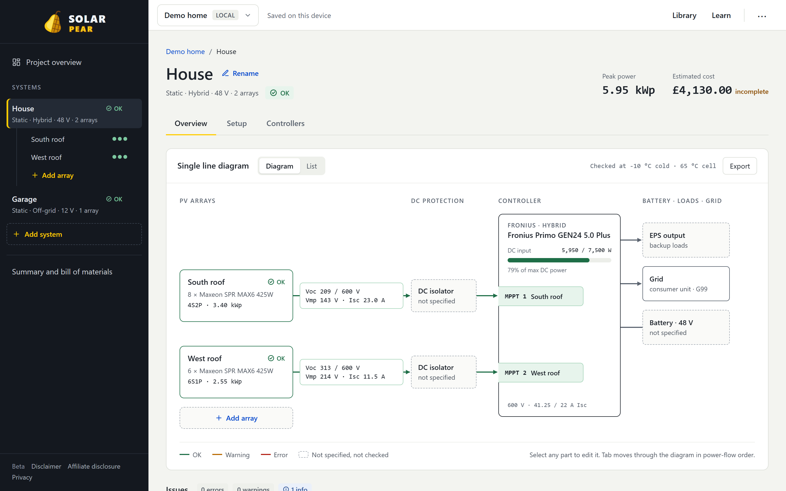
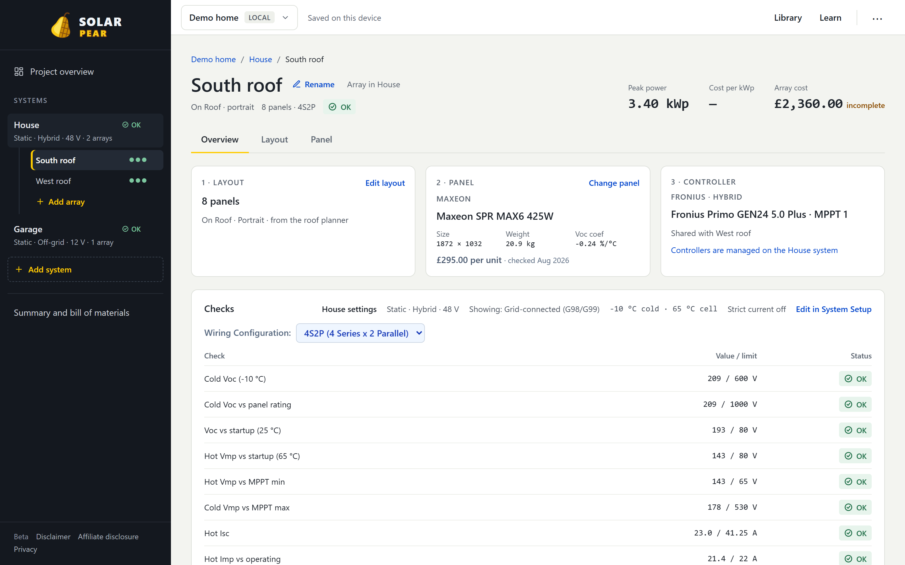

# Solar Pear

**Pair the right panels with your roof. Pair the right controller with your panels.**

Solar Pear is a browser-based tool for designing solar PV setups: define your roof arrays, choose panels that fit (physically and electrically), match them with compatible PV controllers, and get a summary plus bill of materials. All compatibility checks—Voc, Vmp, Isc, format—run in the app so you can iterate without juggling spreadsheets or manufacturer tools.

**Try it:** [solarpear.echook.uk](https://solarpear.echook.uk/)

*No fruit was harmed in the making of this app.*



---

## What it does

- **Projects, systems and arrays**: a project holds one or more systems (one complete installation, such as the house or the garage), and each system holds its roof arrays (orientation, panel count, format, mounting).
- **Layout planner**: draw the roof, add obstacles, and let the planner rank layouts by power or cost. Preview any layout and see what changes before you apply it.
- **Panels**: browse a multi-brand panel database, filter by size, weight and in-roof (GSE) compatibility, and see peak power and cost per kWp for each array.
- **PV controllers**: pick MPPT chargers, hybrid and string inverters or microinverters, and give each array its own MPPT input. Each array is checked against the input it's on.
- **Single line diagram**: every system is drawn from the arrays through DC protection and the controller to the battery, loads and grid. Each problem is listed with the cause, the datasheet figures behind it and a suggested fix. Export the diagram as SVG or PNG.
- **Summary and BoM**: totals and a bill of materials for panels and controllers. Harnesses and mounting are up to you.
- **Backup and restore**: everything lives in your browser. Export it to a JSON file and import it elsewhere.



---

## Getting started

**Prerequisites:** Node.js 20.19+ (or 22.12+) and npm, as required by Vite 7.

```bash
# Install dependencies
npm install

# Run the dev server (default: http://localhost:5173)
npm run dev

# Run tests (single run, CI-friendly)
npx vitest run

# Build for production
npm run build

# Preview production build locally
npm run preview
```

---

## How the checks work

Each array is checked against its assigned MPPT input using worst-case cell temperatures. These default to −10 °C and 65 °C and can be changed per system on its Setup tab:

| Check | Condition | Severity |
| ----- | --------- | -------- |
| Cold Voc | String Voc at the design low exceeds the controller's max PV voltage | Error (can destroy hardware) |
| Panel system voltage | String Voc at the design low exceeds the panel's rated system voltage | Error |
| Voc margin | Cold Voc is above 94% of the controller limit | Warning |
| Startup (open circuit) | String Voc at 25 °C is below the controller's startup voltage, so it never starts | Error |
| Startup (hot) | String Vmp at the design high is below the controller's startup voltage | Warning (harvest loss) |
| MPPT window | Hot Vmp is below, or cold Vmp above, the controller's MPPT range | Warning (harvest loss) |
| Short-circuit current | Array Isc at the design high exceeds the max PV Isc of the controller input it's on (optionally × 1.25 in strict mode) | Error (can damage hardware) |
| Operating current | Array Imp exceeds the controller's PV input current | Warning (clipping) |
| Charger / inverter power | Total array watts on a controller exceed what it can deliver (charge current × battery voltage) or its max PV input | Info or warning |
| String fuses | Three or more parallel strings whose reverse current can exceed the panel's fuse rating | Info or warning |
| Microinverters | Each panel is checked on its own micro input; one micro per panel in the BoM | Per-panel checks |
| Wiring | Panel count is not divisible by the number of parallel strings | Error |
| Physical | Panel is too large or heavy for the array, or doesn't fit the in-roof (GSE) tray orientation | Error |

Temperature coefficients come from each panel's datasheet. The full rules, constants and known limitations are in [`memory-bank/domain-rules.md`](memory-bank/domain-rules.md). The implementation is in [`src/lib/arrayAnalysis.js`](src/lib/arrayAnalysis.js).

---

## Tech stack

- **Vite 7** — Build and dev server
- **React 19** — UI
- **Tailwind CSS v4** — Styling (theme in `src/index.css`, no `tailwind.config.js` by default)
- **Vitest** — Unit tests (with Testing Library and jsdom)

---

## Project structure (high level)


| Area                              | Purpose                                                  |
| --------------------------------- | -------------------------------------------------------- |
| `src/App.jsx`, `src/shell/`        | App shell, routing, pages (systems, arrays, planner, diagram) |
| `src/context/AppStateContext.jsx` | Shared state and persistence                             |
| `src/views/`                      | Summary, panel table, Library and Learn views            |
| `src/components/`                 | Modals, guide, logo, icons                               |
| `src/lib/`                        | Compatibility engine (`arrayAnalysis.js`), diagram layout, planner, storage and migration |
| `src/data/`                       | Panels and controllers: one JSON file per manufacturer in `panels/` and `controllers/`; new files are picked up automatically (`loadData.js`). |


---

## Frontend patterns

- **Loading and error for async views:** If a view later loads data asynchronously (e.g. from an API), it should (a) show a loading state (spinner or skeleton) while fetching, and (b) show an error state with a retry action on failure. Reuse the same patterns as the app load screen in `src/context/AppStateContext.jsx` (loading spinner with "Loading saved data…", error screen with "Start fresh" / retry). This keeps behaviour and accessibility (e.g. `aria-live`, `role="alert"`) consistent.

---

## Data and limitations

- **Storage:** All configuration is stored in your browser (localStorage). Clearing site data or switching devices means starting fresh—unless you’ve exported a backup. We recommend downloading a backup if the setup matters.
- **BoM scope:** The bill of materials covers panels and PV controllers only. No cables, connectors, or mounting; treat it as a component list, not a full quote.
- **Prices:** Pre-loaded prices are estimates, shown with the month they were last checked. Products with no known price show "—" and are left out of totals rather than counted as free. Your own price edits are kept when the catalogue is refreshed; prices you haven't edited update automatically.
- **AI-generated notes:** Panel and controller notes are AI-derived and may be imperfect. Use them as a starting point, not the final word.
- **Compatibility only:** The app checks electrical compatibility (Voc hard limit; Vmp startup and Isc clipping warnings; format). It does not produce wiring diagrams or installation instructions.

---

## Scripts reference


| Command                 | Description                          |
| ----------------------- | ------------------------------------ |
| `npm run dev`           | Start Vite dev server                |
| `npm run build`         | Production build (output in `dist/`) |
| `npm run preview`       | Serve the production build locally   |
| `npm run test`          | Run Vitest in watch mode             |
| `npx vitest run`        | Run tests once (e.g. in CI)          |
| `npm run test:coverage` | Run tests with coverage report       |


---

## Contributing

- **Bad data or missing products:** open an issue using the *Data correction* or *Missing product* template, ideally with a datasheet link.
- **Bugs:** open an issue using the *Bug report* template.
- **Code:** see [`memory-bank/`](memory-bank/README.md) for architecture and conventions, and [`memory-bank/roadmap.md`](memory-bank/roadmap.md) for planned work. Reference roadmap task IDs in commit messages (e.g. `fix(1.3): ...`). Run `npx vitest run` before opening a PR.
- **Catalogue editing:** the local `data-admin/` tool (`cd data-admin && npm install && npm run dev`) and the `verify:*` scripts are described in [`verification_scripts/README.md`](verification_scripts/README.md).

---

## License

GNU General Public License v3.0 (GPL-3.0). See `LICENSE`.